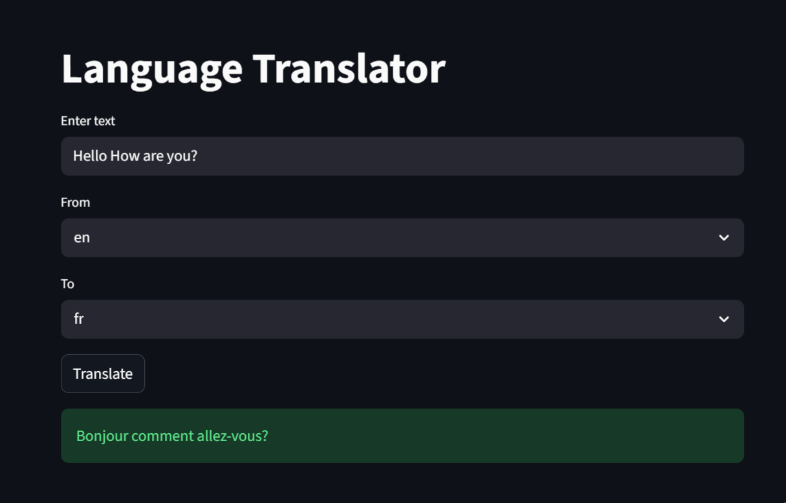

# Language Translator

A simple and interactive Language Translation web app built using Streamlit and GoogleTranslator API. It allows users to translate text between multiple languages instantly with a clean and user-friendly interface.

---

## Features

* Translate text between multiple languages
* Fast and accurate translation
* Simple and clean UI
* Supports multiple language options

---

## Project Structure

```
.
├── outputs/
│   └── Language Translator (output).mp4
├── src/
│   └── app.py
├── requirements.txt
└── README.md
```

---

## Requirements

Make sure Python is installed, then run:

```
pip install -r requirements.txt
```

---

## How to Run

Run the app using:

```
streamlit run src/app.py
```

---

## Preview

```

```

---

## Technologies Used

* Python 
* Streamlit
* deep-translator

---

## Author

Mahnoor Fatima
